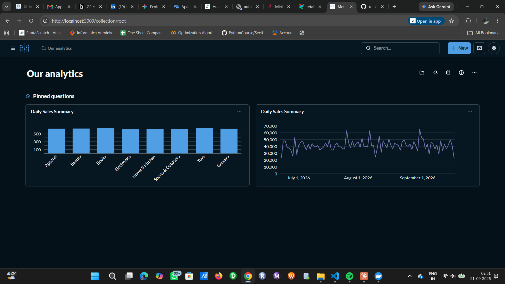

# RetailPulse — Local, Zero-Cost Data Engineering Pipeline

An end-to-end batch ELT pipeline built entirely with open-source tooling on Docker —
no cloud subscription required. Designed as a resume-ready portfolio project that
mirrors a production medallion architecture (bronze/silver/gold) with orchestration,
transformation, modeling, and data quality gates.



## Architecture

```
Faker (synthetic data)
      |
      v
MinIO [raw / bronze]   <-- S3-compatible object storage
      |
      v
PySpark (clean, dedupe, SCD Type 2)
      |
      v
MinIO [silver]  (Parquet)
      |
      v
dbt-core (staging -> intermediate -> marts)
      |
      v
PostgreSQL [gold]      <-- curated warehouse
      |
      v
Metabase                <-- BI dashboards

Orchestrated end-to-end by Apache Airflow.
Data quality checked at each layer boundary by Great Expectations.
```

## Why this design

- **MinIO** instead of AWS S3 — identical API (`boto3`), so the code is portable to real S3 with just a config change.
- **Airflow** instead of ADF/Autosys — same DAG-based orchestration concepts, open source.
- **Postgres** instead of Azure SQL/Snowflake — full SQL warehouse semantics for the gold layer.
- **dbt-core** instead of dbt Cloud — same modeling/testing workflow, free CLI.
- Everything runs in Docker, so the whole stack is reproducible with one command and costs nothing.

## Prerequisites

- Docker Desktop installed and running
- Python 3.10+ (for running ingestion scripts locally, outside Airflow, if you want to test them standalone)
- Git

## Setup

1. Clone this repo and `cd` into it.
2. Copy the environment file:
   ```bash
   cp .env.example .env
   ```
3. Start the stack:
   ```bash
   docker-compose up -d
   ```
4. Wait ~1-2 minutes for everything to initialize, then check:
   - MinIO console: http://localhost:9001 (login with the credentials in `.env`)
   - Airflow UI: http://localhost:8080 (login: `admin` / `admin`)
   - Metabase: http://localhost:3000 (first-run setup wizard, connect it to the `postgres` service, DB `retailpulse`)

5. In the Airflow UI, un-pause the `retailpulse_pipeline` DAG and trigger a manual run to test Week 1's ingestion → landing flow.

## Project structure

```
retailpulse/
├── docker-compose.yml       # Spins up MinIO, Postgres, Airflow, Metabase
├── .env.example             # Copy to .env — all credentials configurable here
├── requirements.txt         # Python deps for local script testing
├── ingestion/
│   ├── generate_data.py     # Synthetic order data generator (Faker)
│   └── load_to_minio.py     # Uploads raw data into MinIO's 'raw' bucket
├── dags/
│   └── retailpulse_pipeline.py   # Airflow DAG (Week 1: generate + land)
├── dbt/                      # Week 3: dbt project will live here
├── great_expectations/       # Week 4: data quality suite will live here
└── notebooks/                # Scratch space for exploring data in Jupyter
```

## Roadmap

- [x] **Week 1** — Docker infra, MinIO buckets, synthetic data generator, Airflow DAG landing raw data
- [x] **Week 2** — PySpark transform job (raw → silver), SCD Type 2 dimension
- [x] **Week 3** — dbt-core project (silver → gold in Postgres) with a point-in-time SCD2 join, Airflow DAG extended end-to-end
- [x] **Week 4** — Data quality tests via `dbt-expectations`, Metabase dashboards

### A design decision worth knowing: dbt-expectations instead of Great Expectations

The original plan called for standalone Great Expectations. In practice, GX pulls in
its own pandas/SQLAlchemy/jsonschema dependency chain, and this project already hit
real version conflicts between Airflow, pandas, and SQLAlchemy while building Week 3
(documented in `docker-compose.yml`'s comments). Adding another heavy Python
dependency into the same Airflow container risked reopening that exact class of
problem for marginal benefit.

Instead, this project uses **`dbt-expectations`** (see `dbt/packages.yml`) — a dbt
package that ports most of Great Expectations' test vocabulary (value ranges, set
membership, row-count sanity checks) directly into dbt's own SQL-based test
framework. It needs no new Python packages in Airflow at all, and is a common,
production-legitimate choice in dbt-centric stacks. See `dbt/models/marts/schema.yml`
for the tests in use (row-count checks, value ranges on `quantity`/`unit_price`/
`total_amount`, accepted values on `order_status`).

Standalone Great Expectations remains a reasonable stretch goal if you want to add it
later — the empty `great_expectations/` folder is left in place for that.

## Metabase dashboards

Metabase runs at http://localhost:3000. First-time setup:

1. Create an admin account (local only, not sent anywhere).
2. When asked to connect a database, choose **PostgreSQL** and enter:
   - Host: `postgres` (if adding the connection from within a Metabase container context) — from the setup wizard in your browser, Metabase actually talks to Postgres via Docker's internal network, so use `postgres` as the host, port `5432`, database `retailpulse`, and the credentials from your `.env` file.
3. Once connected, browse to the `gold` schema — you'll see `fct_orders`, `dim_customer`, and `daily_sales_summary`.
4. Build 2-3 questions/charts against `daily_sales_summary`: e.g. a line chart of `total_revenue` over `order_date`, a bar chart of `total_orders` by `product_category`. Pin them to a dashboard.

This is the same BI layer pattern as Power BI/Looker sitting on top of a warehouse —
just self-hosted and free.

## Local development tips (Windows / PowerShell / Git Bash)

- Run `docker-compose up -d` from Git Bash to avoid path-mangling issues with volume mounts.
- If a port is already in use (common with 5432 or 8080), change the left-hand side of the port mapping in `docker-compose.yml`, e.g. `"8081:8080"`.
- To reset everything and start clean: `docker-compose down -v` (this wipes the Docker volumes — MinIO and Postgres data).
